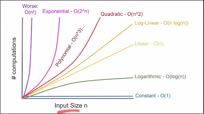

- Time complexity is the realtion bw operations and input values in an algorithm , input can be of any type array , lists, strings or stuff
(slope of the graph is bascially the time complexity)

## Big O Notation:
- used to describe the time or spave complexity of algorithms
- way to express an upper bound of an algorithm's time or space complexity
- can be used to compare the efficiency of diff data structures or algors
- It provides an upper limit on the time taken by an algorithm in terms of the size of the input. We mainly consider the worst case scenario of the algorithm to find its time complexity in terms of Big O
- we ignore the lower order terms and consider only the highest order term
- ignore the constant associated with highest order items too

## Common Complexities:
### 1: O(1) - Consant
- Graph is a straight line 
- For example , a program where we are accessing an index in an array such types of operations are constant
(index and array both values are known)

### 2: O(n) - Linear
- Linear graph ofc
- for e.g, linear search algorithm

### 3: O(n^2) - Quadratic
- like nested loops or matrices :3

### 4: O(log n)
- Binary Search algorithms
(soted array -> mid value comparison bla bla)
- Also this complexity is way better than linear one
i.e O(log n)>>O (n) similarly 0(n log n) >> O(n^2)

### 5: O(nlogn):
- Sorting algorithms

### 6: O(2^n):
- Recursion

### 7: O(n!):
- rarely used 
- worst of all XD

